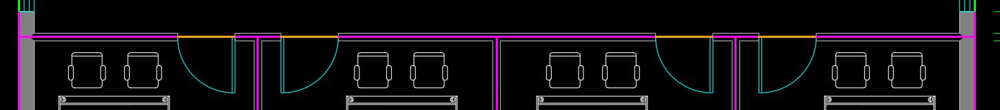
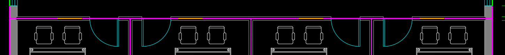

# 二层四个办公室门：生成后的原图抽查

四门从房间居中移到相邻隔墙附近，修订后的橙色开口线能与原图青色门弧对应的墙缝相接；旧位置大段落在实墙上。该局部改善有原图支持。

品红为源房间边界，橙色为源门洞，青色为原图门弧。图由现有确定性叠图工具在生成结束后绘制，使用2f_view.png总宽15000mm和总高8000mm标注的近似外框像素锚点：x=[427,1813]，y=[1071,332]；裁图范围[400,740,1850,900]。标定侧车记录来源与限制：[候选](candidate_01_F2_office_doors_overlay.json)、[种子](seed_F2_office_doors_overlay.json)。该叠图不进入生成环境，也不算模型自己调用叠图。

四个新x范围为[2.49,3.39]、[4.11,5.01]、[9.99,10.89]、[11.61,12.51]m，均保留原房间至走廊的连接端。图上各门约0.9m，门框笔画与开口端点的小偏差不作为毫米级验收。二层会议室两门、本轮未改的一层门宽、高度与扇数不在这份抽查范围内。

本次15窗的坐标和宿主未变，独立窗比较仍15/15；源房间边界也未变，一层隔墙错误仍须处理。模型关于“0.36m为隔墙半厚度”的新增文字没有这份叠图的支持，也与已有墙厚说明不相容，不能用几何局部改善替它背书。
