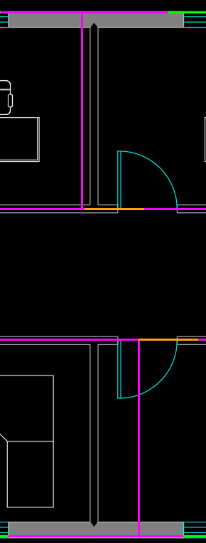
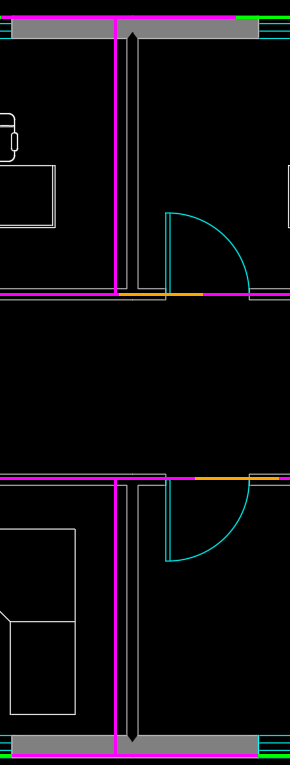

# 一层第二处南侧隔墙：生成后原图核对

源墙从x=10.68m移到9.82m，明显偏移缩小，但仍偏在原图墙线左侧。原图标注/既有独立参照支持约10m墙位；不能将新位置解释成精确恢复。

| 旧候选 | 新候选 |
|---|---|
|  |  |

品红为源房间边界、橙色为源门洞，灰白为原图墙/家具，青色为原图开口符号。上、下房间的墙对齐不意味着走廊中存在连续实体隔墙：两图中央均为开敞走廊，本次局部操作没有加假墙。

这份叠图由开发助手在生成后用既有确定性工具制作，不是总Agent自行调用。原图为1f_view.png；用该图外墙边界近似锚点x=[425,1816]映射[0,15]m、y=[1085,348]映射[0,8]m，结合原图15000/8000mm总尺寸；裁图[1220,330,1510,1095]。每图标定独立核对，未拿候选墙位或GT反拟合。侧车：[旧](seed_F1_partition_overlay.json)、[新](candidate_01_F1_partition_overlay.json)。微小像素/墙面基准差异不是本页的毫米验收目标。

自动分区比较仍severe，主要是4处代表墙位与参照的距离差异；房间数量和连通没有因此增减。约0.18m剩余偏差应结合墙面基准解释，不能只靠标签判定是否值得继续追尺寸。当前更明确的失败是模型将-0.24m闭合差说成闭合，并舍弃已计算的5m/10m累计点；见 [实际工具结果对照](tool_claim_audit.json)。
