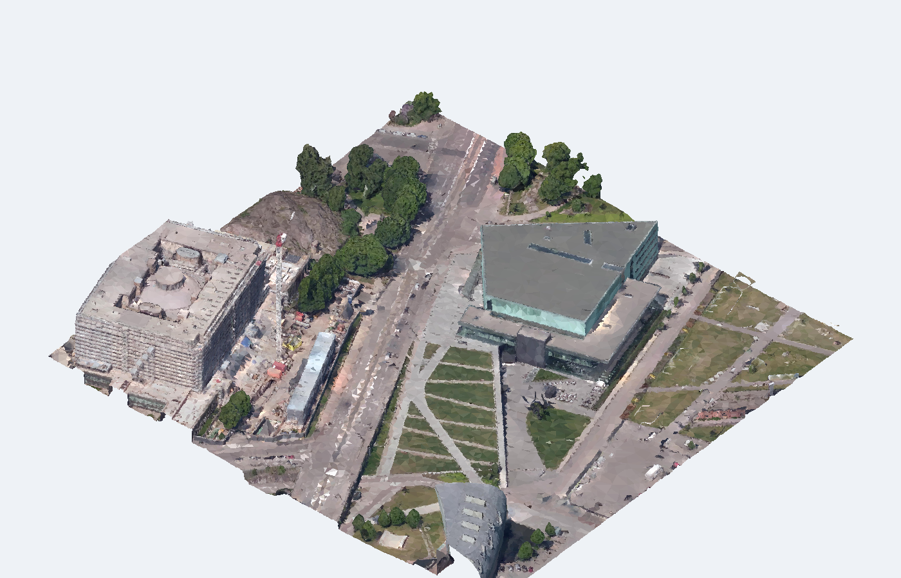
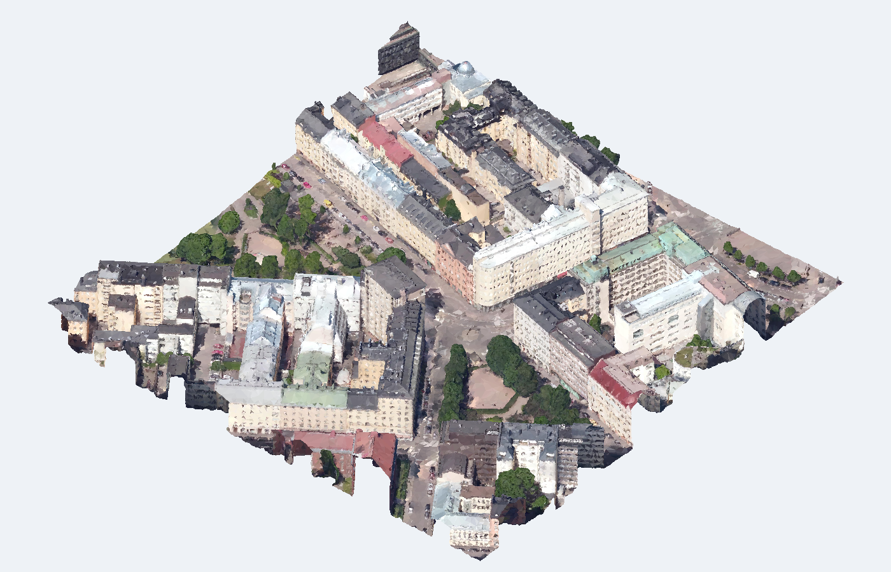
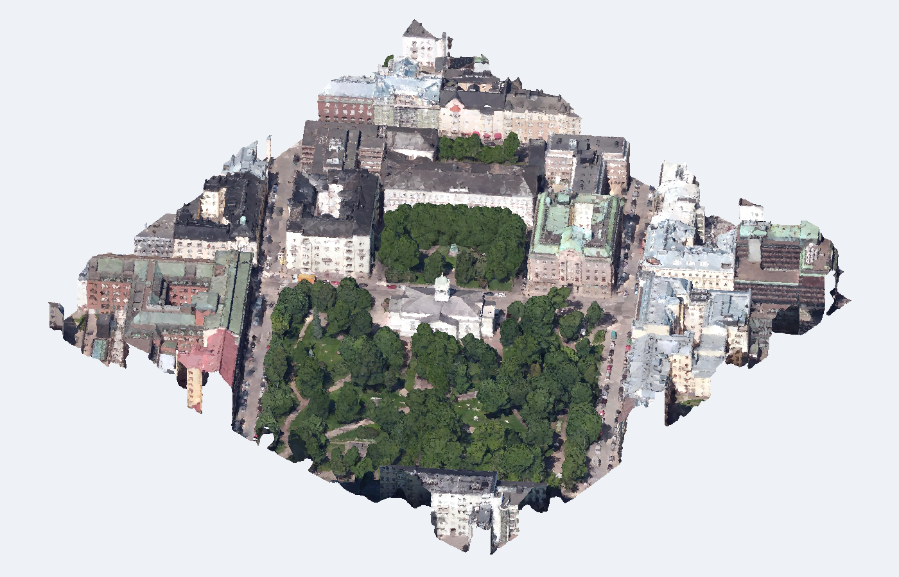

# 2026-09-10 带贴图体量：调研与实取案例

**已经取得三个真实城市网格片区，均含几何与图片贴图，可作为首批素材池。尚未裁出单栋，也未运行体量到 BIM。** 原始数据与本地贴图查看页在 `case_tests/textured_mass/`；大文件不进 Git，下载清单、校验和复现脚本入仓。

[素材清单与复现](../../../../case_tests/textured_mass/README.md) · [路线判断与外部来源](../../../design/textured_mass_route.md) · [机器检查](../../../../case_tests/textured_mass/inspection.json)

下图是本机对实际网格按面中心纹理采色生成的选材概览，不是精细贴图截图；三角形色块不能直接解释为原始纹理质量。实际 UV 贴图保留在 GLB 和 HTML 中。HTML 脚本已做语法检查，本环境未实际运行浏览器。

## 1. 独立体量：用途未核实

`Tile_+1985_+2693`，约 21.8 万三角面，8192 × 4096 贴图。可见道路分隔的主体；用途、真实层数和室内尚未确认。用户后续明确普通办公、住宿与商业优先，故撤下仅按独立外形作出的首例推荐，待核实类型再选。

[另一方向](Tile_+1985_+2693_130.png) · [本机贴图查看](../../../../case_tests/textured_mass/derived/Tile_+1985_+2693/viewer.html) · [纯输入 GLB](../../../../case_tests/textured_mass/derived/Tile_+1985_+2693/input.glb)

## 2. 连续街区与内院

`Tile_+1984_+2690`，约 38.6 万三角面，8192 × 4096 贴图。适合检验楼体范围、共享边界、内院、重复窗和瓦片边缘截断；不能把整块街区当一栋建筑。

[另一方向](Tile_+1984_+2690_130.png) · [本机贴图查看](../../../../case_tests/textured_mass/derived/Tile_+1984_+2690/viewer.html) · [纯输入 GLB](../../../../case_tests/textured_mass/derived/Tile_+1984_+2690/input.glb)

## 3. 树木遮挡与周边场景

`Tile_+1986_+2690`，约 46.0 万三角面，8192 × 8192 贴图。含连续楼体、内院和大片植被，可检验树木/建筑区分、遮挡部分的明确推断与场景保留。

[另一方向](Tile_+1986_+2690_130.png) · [本机贴图查看](../../../../case_tests/textured_mass/derived/Tile_+1986_+2690/viewer.html) · [纯输入 GLB](../../../../case_tests/textured_mass/derived/Tile_+1986_+2690/input.glb)

## 证据和边界

- 三片均为约 252 × 252 米的瓦片包围盒；全部来自 SUM / City of Helsinki，跨城市表现尚未覆盖。City of Helsinki / SUM，Gao et al., 2021，来源与许可见素材清单。
- PLY 加载、有限坐标、合法面索引、纹理图片、GLB 再加载与面数保留均检查通过；纯输入通过允许字段重建，未导出原标注。具体校验见 `inspection.json` 和 `roundtrip_checks.json`。
- 另取得 House / Village house 和 PBR Textured Building，共 738 / 9,654 三角面；均列为人工建模工具对照，尺度未验证。不是两个新的实景扫描 case。
- 墨尔本官方 570 区域下载索引已保存，A1-11 / A1-12 两次 HEAD 200，分别 33,443,435 / 30,910,544 字节；未下载整包，不能称已验收其内容。
- SUM Parts 有窗/门等部件标注，完整数据需登录并同意联系信息共享，未代用户操作。Zenodo 两个单栋扫描记录和一个 Helsinki 高精网格记录在本环境访问超时，未计入已取得素材。
- 没有模型实验、DeepSeek、付费 API、EP 或跨模型评审。本次脚本仅用于素材调查，不是新增生产流程。
