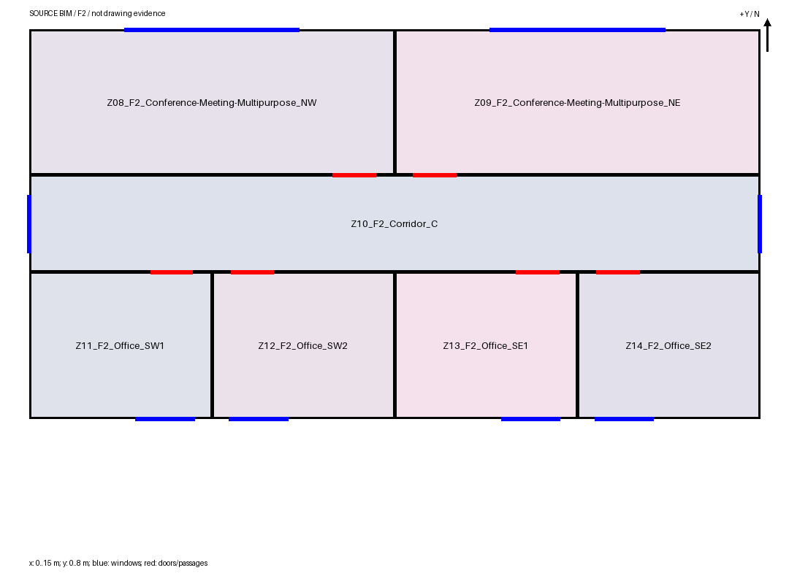
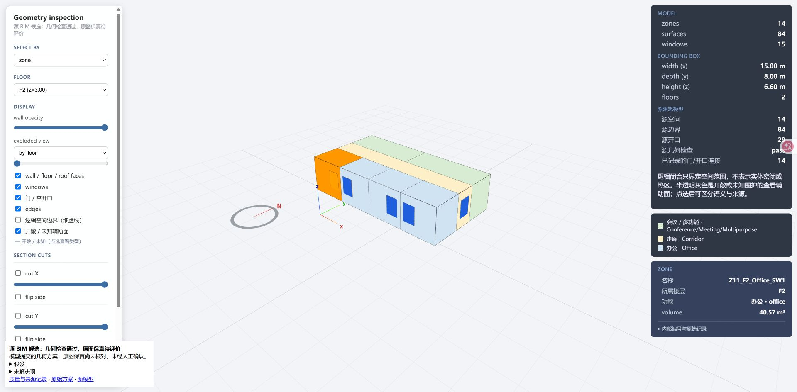

# N1 执行报告：公开命名与产物显示

状态：实现及离线检查完成，交 Opus 复核合并；sm24 浏览器实点选尚未取得，见 E 的边界。执行方 Astra，独立实现，未派子代理。基准提交 `faaa6991`，工作树 `C:\Users\Horton\Desktop\EnergyPlus-Agent-worktrees\n1`，分支 `dev/astra-n1-20261007`。

**迭代范围：domain 的 BIM rules（公开命名）以及 kernel/tools 的出图、查看页和交付报告显示；单模型、分工两种模式共用。** 未改 runtime、roles、guidance、工具说明或正式 Agent 版本登记；没有提交、暂存或其他 `.git` 写操作。work model 请求 0，Paratera 0，DeepSeek 0，求解器 0；未运行真实整案或全量检查。

## 开工与改动边界

- 已完整读取本目录 `Agent.md`、产品目标、当前任务、工作方式、名词规范及当前交接 `2026-10-07_opus_night_role_division.md`，另读派工单、命名设计、用途表和 N1 验收条件；检查了工作树、分支状态和近期提交。
- 开工已有修改的 `brief.md` 与 `AI_agent/project/unified_agent_acceptance.md` 保持原状，不能计入本包实现。
- 主树 `EnergyPlus-Agent-dev/AI_agent/archive/local_backup/cmp3/` 只读。四份选中交付稿先复制到本树 `AI_agent/archive/local_backup/n1/snapshots/`，再从副本重绘。
- 没有重建四份案例的物理模型或重算其回查结论。源文件、交付 JSON、源哈希、内部编号、门窗宿主、连接和坐标均保持；原回叠 PNG 原样复制，不增加名字。

## A–F 结果

| 验收 | 结果与证据 |
|---|---|
| A 用途段短横 | 完成。35 个 `name_token` 从词内下划线改为短横；与基准目录逐字段比较，上游代码、中文名、颜色、别名及其余内容不变。房间名严格四段。 |
| B 重复方位编号 | 完成。同源楼层、同用途、同方位按原北到南／西到东顺序加 1、2…；单间不加。列表反序、两层独立计数检查通过。sm21 两稿二层南侧均为 SW1、SW2、SE1、SE2。 |
| C 名称显示统一 | 完成实现。平面文件及标题用 F1/F2，标签为完整公开名，长名按分隔符换行；查看页房间、楼层、面、门窗、边及连通两端用公开名，追溯栏默认收起。报告和查看页正文里的完整对象引用转换为公开名，路径／URL 保留。源 JSON 中的机器引用不改。8 份 HTML 正文均通过无遗漏完整引用检查。EP 派生适配器实测接受短横与编号，不运行 EP 求解器。 |
| D 版本与设计 | 完成。新源输出使用 `bim_names_v3`；[命名设计](../../../design/bim_naming.md)已替换规则。旧归档不改写；旧源的重绘在显示层刷新映射。 |
| E 四稿离线重绘 | 完成 4 个查看页、4 份交付 HTML、6 张平面图和 44 个房间的前后对照。6 张图均已目视查看。两份 sm21 的八间南侧办公室实际点选通过，另核对楼层、墙、窗、边、门及连通名；展开可见原 ID。sm24 的图像、映射和正文核对通过，但浏览器连接随后持续超时，**没有取得两份 sm24 的实际点选记录**，不将静态核对写成实点选通过。 |
| F 检查与交付 | 最终 73 项不同的局部／离线贯通检查通过，均 `-n 2`，无全量。三例 scripted adapter 使用真实冻结 MCP 工具贯通，0 次真实模型请求。正式版本表未改，测试使用项目已有的临时版本表入口，仍检查文件与工具目录哈希。 |

## 改前改后

完整 44 行见 [名字对照](evidence/name_comparison.md)；[JSON](evidence/name_comparison.json)同时保留内部编号方便定位。

| 稿件／对象 | 改前公开名 | 改后公开名 |
|---|---|---|
| sm24 单模型会议室 | `Z04_F1_Conference_Meeting_Multipurpose_NE` | `Z04_F1_Conference-Meeting-Multipurpose_NE` |
| sm24 单模型复印区 | `Z02_F1_Copy_Print_NE` | `Z02_F1_Copy-Print_NE` |
| sm24 单模型两间办公室 | `Z03_F1_Office_Enclosed_NW`、`Z05_F1_Office_Enclosed_NW` | `Z03_F1_Office-Enclosed_NW1`、`Z05_F1_Office-Enclosed_NW2` |
| sm21 分工二层南侧 1 | `Z11_F2_Office_SW` | `Z11_F2_Office_SW1` |
| sm21 分工二层南侧 2 | `Z12_F2_Office_SW` | `Z12_F2_Office_SW2` |
| sm21 分工二层南侧 3 | `Z13_F2_Office_SE` | `Z13_F2_Office_SE1` |
| sm21 分工二层南侧 4 | `Z14_F2_Office_SE` | `Z14_F2_Office_SE2` |
| sm21 单模型二层南侧 1 | `Z11_F2_Office_Enclosed_SW` | `Z11_F2_Office-Enclosed_SW1` |
| sm21 分工平面文件／标题 | `plan_PLAN.F2.png`／`PLAN.F2` | `plan_F2.png`／`F2` |
| sm24 分工说明中的房间引用 | `seed-office-south` | `Z08_F1_Office_SE` |

单模型稿将办公室分类为 `office/enclosed`，分工稿为 `office`，所以用途分别保留 `Office-Enclosed` 与 `Office`。本包统一命名，不改这些已有的用途判断。

## 打开产物

总入口：[四稿查看、交付报告与平面图](../../../archive/local_backup/n1/rendered/index.html)。以下均相对 `AI_agent/archive/local_backup/n1/rendered/`，双击 HTML 即可离线打开，无外部脚本依赖。

| 稿件 | 查看页 | 平面图 |
|---|---|---|
| sm24 单模型 | `sm24_single/bim/candidate_18/viewer.html` | 同目录 `plan_F1.png` |
| sm24 分工 | `sm24_role/bim/candidate_03/viewer.html` | 同目录 `plan_F1.png` |
| sm21 分工 | `sm21_role/bim/candidate_09/viewer.html` | 同目录 `plan_F1.png`、`plan_F2.png` |
| sm21 单模型 | `sm21_single/bim/candidate_05/viewer.html` | 同目录 `plan_F1.png`、`plan_F2.png` |

每稿的交付报告为 `bim/delivery.html`，当前名字映射为候选目录的 `public_names.json`。为保留历史回查绑定，复制的旧 `source_model.json` 内仍保留 v2 元数据；显示层及新映射文件使用 v3。新建候选直接输出 v3 源元数据。不要把这次重绘当成新的模型生成或质量验收。

持久证据：[四稿源与产物校验](evidence/verification.json)、[检查汇总](evidence/checks_summary.json)、[浏览器实点选记录](evidence/browser_checks.json)。六张平面图也已复制到本实验 `evidence/`，以免只剩被忽略的临时产物。





## 实现入口和模型请求影响

| 文件 | 改动 |
|---|---|
| `src/agent/data/room_types.json` | 只替换公开用途 token 的词内分隔符 |
| `src/agent/geometry/source_naming.py` | v3、重复方位编号、旧源显示映射、正文对象引用转换 |
| `src/agent/geometry/source_plan_view.py` | 公开楼层标题和完整房间标签、长名换行、显示元数据 |
| `scripts/tool_scripts/run_bim_agent.py` | `Toolkit.plan_view` 采用公开楼层文件名；`Toolkit.delivery` 调用独立 HTML 显示器 |
| `scripts/tool_scripts/bim_agent_delivery_display.py` | 从原 `delivery` 代码分出纯 HTML 显示，不重算或写改评审状态 |
| `scripts/tool_scripts/render_geometry_viewer.py` | 全部对象引用公开名、默认折叠原始 ID 与追溯记录 |
| `src/agent/execution/source_proposal.py` | 查看页正文引用统一；抽出旧源也可复用的显示函数 |
| `tests/test_source_naming.py`、`tests/test_bim_agent_tools.py` | 更新被替代预期；新增分组、EP 派生、旧源只读出图、正文与证据分离检查 |

`source_bim.py` 已读取，沿用已有建源时生成公开映射的入口，无需修改。`room_types_reference()` 继续只向模型提供原有代码、中文名、颜色和注释，用途表的模型可见内容不变；模型提示、角色指引、工具描述与参数 schema 没变。

工具**返回产物**有预期变化：`plan_view` 返回新版标签 PNG、`plan_Fn.png` 路径和新增显示字段 `floor_name`／`space_names`／`naming_scheme`，原 `floor_id`／`space_ids` 保留；新候选源文件的公开映射、目录哈希和依赖它们的源哈希变化，原始 ID 与几何不变。凡直接读取这些源字段的工具回复也可能含新公开名。因此“模型请求内容不变”指没有更改模型输入指令和工具契约，不能解释为生成后的图像／工具回复逐字节相同。

## 检查与复现

所有命令从工作树根运行，先 `. .\scripts\activate_windows.ps1`；已确认 `src.agent.__file__` 指向本工作树。最终 73 项不同检查通过；Node 语法检查重复运行一次，不重复计数。

| 范围 | 结果 | 留存 |
|---|---|---|
| 命名、查看页、跨层出图、源 BIM | 48 passed，14.30 秒 | [focused.xml](evidence/focused.xml) |
| 源方案、交付与回复、选定 stdio／中断检查 | 21 passed；同批 3 个贯通因正式旧版本哈希失败 | [原始批次](evidence/delivery-three-case.xml) |
| 临时版本表下 sm21／sm24／sm25 离线贯通 | 3 passed，141.54 秒 | [three-case.xml](evidence/three-case.xml) |
| 新增正文引用／证据保持、最终 JS 语法 | 2 passed，10.82 秒（其中 1 项与前组重复） | [prose.xml](evidence/prose.xml) |

最初一次检查另有一个新测试夹具错误：重排列表后沿用旧源哈希调用 EP 派生，已改为对未重排副本派生；48 项通过结果包含该修正。版本表失败则来自本包已修改的六个正式登记文件，未禁用校验：在 `archive/local_backup/n1/agent_versions.scratch.json` 复制登记，登记本工作代码和新增显示模块，沿用原工具目录哈希，再设置 `BIM_AGENT_REGISTRY_PATH` 跑三例。最终再次验证工作代码仍与通过测试时的临时登记哈希一致。正式版本表由 Opus 合并后登记。

```powershell
. .\scripts\activate_windows.ps1
python -m pytest -n 2 tests/test_source_naming.py tests/test_geometry_viewer.py tests/test_source_spanning_feedback.py tests/test_source_bim.py --basetemp AI_agent/archive/local_backup/n1/pytest/focused -q
python -m pytest -n 2 tests/test_source_proposal.py tests/test_bim_delivery.py tests/test_bim_delivery_reply.py tests/test_bim_agent_tools.py::test_normal_stdio_builds_candidate_and_returns_plan_image tests/test_bim_agent_tools.py::test_room_use_stdio_updates_function_and_retains_physical_source tests/test_bim_agent_tools.py::test_delivery_keeps_numeric_contradiction_and_calibration_warning_with_empty_notes tests/test_bim_agent_tools.py::test_interrupted_run_keeps_candidate_and_labels_delivery_incomplete --basetemp AI_agent/archive/local_backup/n1/pytest/delivery -q
$env:BIM_AGENT_REGISTRY_PATH = (Resolve-Path 'AI_agent/archive/local_backup/n1/agent_versions.scratch.json').Path
python -m pytest -n 2 tests/test_role_end_to_end.py::test_scripted_role_pipeline_runs_real_frozen_mcp --basetemp AI_agent/archive/local_backup/n1/pytest/three-case -q
python AI_agent/logs/experiments/2026-10-07_bim_naming_n1/rebuild_display.py
```

浏览器验证先依 Playwright 技能尝试 CLI，Chrome 子进程启动超时；切换已连接的 Chrome 后成功点选。两份 sm21 的八间南侧办公室均见公开名，分工稿另检查楼层、墙、窗、边和内部共享门；单模型稿的功能依据中的窗口引用也显示公开名。保留了一张实际截图。后续保存截图时连接持续超时，故没有声称完成 sm24 实点选或所有 44 间逐一浏览器点选。

## 交回 Opus 与建议提交分组

1. **domain · BIM rules 与公共显示**：全部实现文件及对应测试，提交题目可用 `feat(domain): unify BIM public names and displays as v3`。这些改动作为完整命名包一起合并，避免用途 token 和显示函数分别落地时产物混用。
2. **domain · 设计与 N1 验证证据**：`AI_agent/design/bim_naming.md`、本实验 README／重绘脚本／`evidence/`。不要夹带开工已有的派工单和全局验收文档修改。

合并时把新 `scripts/tool_scripts/bim_agent_delivery_display.py` 纳入正式 Agent 文件登记；本包临时验证已将它作为 `tool` 登记，并未更改正式版本。建议 Opus 在验收时打开两份 sm24 查看页补一次长用途名的点选。本包不能据此宣称三例对照真实整案的新质量结果。

临时目录清理情况在 `evidence/cleanup.json`；保留 `snapshots/`、`rendered/` 和临时版本表供复核。清理工作树前请先按需收存四个完整查看页目录，本实验内已有六张图、实点选截图、名字对照及检查证据。
