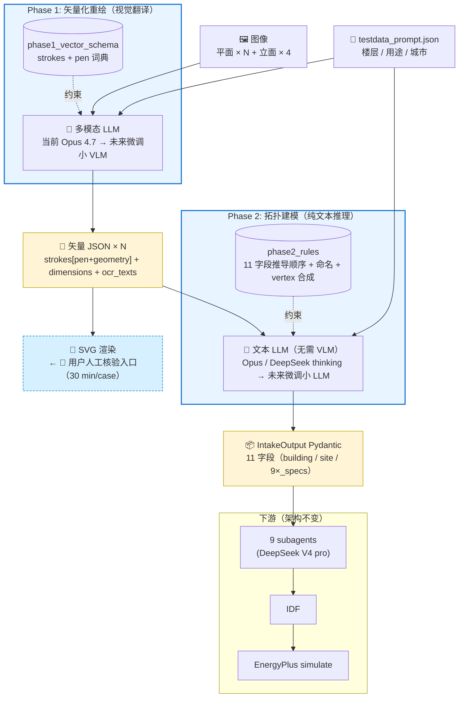
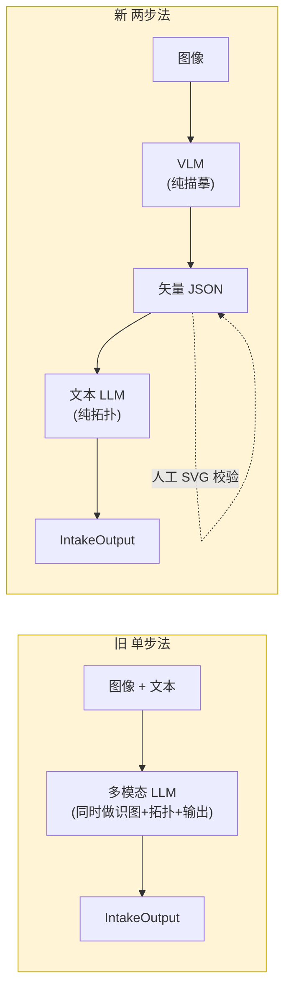
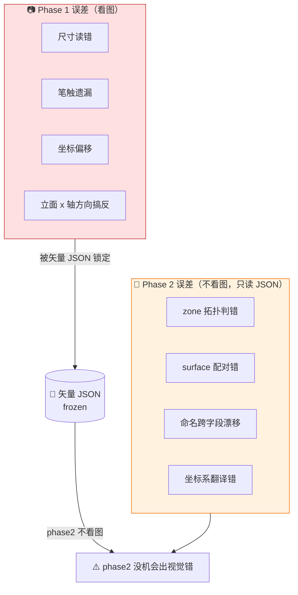
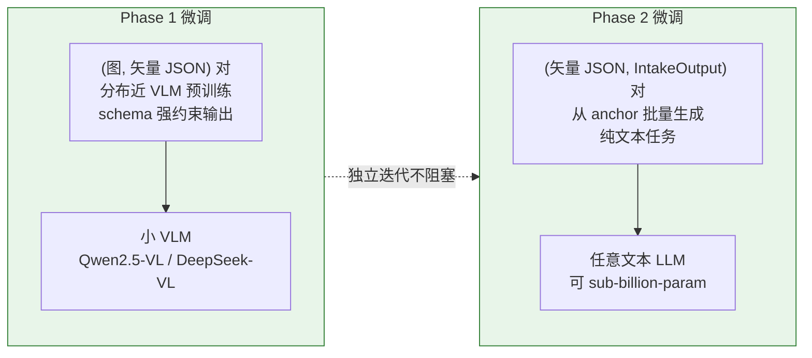

# 两步法 intake 架构图示（汇报用）

> 配合 [`floorplan_redraw_strategy.md`](floorplan_redraw_strategy.md) §9 POC 结果使用。

---

## 1. 总览（Mermaid，多数 markdown viewer 直接渲染）



---

## 2. ASCII 备用（无 Mermaid 渲染环境）

```
┌─────────────────────────────────────────────────────────────────┐
│  输入                                                            │
│  🖼️ 图像（平面 × N + 立面 × 4）   📄 testdata_prompt.json       │
└────────┬──────────────────────────────┬─────────────────────────┘
         │                              │
         ▼                              │
┌─────────────────────────────────────┐ │
│ Phase 1: 矢量化重绘（视觉翻译）       │ │
│ ─────────────────────────────────── │ │
│ • 多模态 LLM (Opus 4.7 → 小 VLM)    │ │
│ • 约束: phase1_vector_schema        │ │
│   (strokes + pen 词典)              │ │
└────────┬────────────────────────────┘ │
         │                              │
         ▼                              │
   📐 矢量 JSON × N                     │
   (strokes[pen+geometry] +             │
    dimensions + ocr_texts)             │
         │                              │
         ├──→ 🎨 SVG 渲染               │
         │     ← 👤 用户人工核验         │
         │       (30 min / case)        │
         │                              │
         ▼                              ▼
┌─────────────────────────────────────────────────────────────────┐
│ Phase 2: 拓扑建模（纯文本推理，无需 VLM）                          │
│ ─────────────────────────────────────────────────────────────── │
│ • 文本 LLM (Opus / DeepSeek thinking → 小 LLM)                  │
│ • 约束: phase2_rules (11 字段推导顺序 + 命名 + vertex)            │
└────────┬────────────────────────────────────────────────────────┘
         │
         ▼
   📦 IntakeOutput Pydantic（11 字段）
         │
         ▼
┌─────────────────────────────────────────────────────────────────┐
│ 下游（架构不变）                                                  │
│   9 subagents (DeepSeek)  →  IDF  →  EnergyPlus simulate         │
└─────────────────────────────────────────────────────────────────┘
```

---

## 3. 与单步法对比



| 维度 | 旧 单步法 | 新 两步法 |
|---|---|---|
| LLM 调用 | 1 次（多模态） | 2 次（VLM + 文本 LLM）|
| 中间产物 | 无（黑箱）| 矢量 JSON（人工可校验）|
| 误差归因 | 视觉错 + 推理错纠缠 | **识图错 ⇿ 推理错可分离** |
| 微调可行性 | 单一 (图, IntakeOutput) 大目标 | 拆 (图, 矢量 JSON) + (矢量 JSON, IntakeOutput) 两数据流 |
| 图风格泛化 | prompt 硬编码制图规范 → 风格切换易失效 | phase1 schema 是制图规范，可独立扩展 |

---

## 4. 误差预算分离（两步法核心收益）



**关键含义**：sm_20 POC 实证 — anchor 单步法的 F3 corridor 窗 `z_max = 9.60`（**视觉错与推理纠缠**）；两步法两条路径都给 `z_max = 10.60`，因为 phase1 已把"窗高=2.40 / sill=1.00 / top_gap=1.40"识图层面锁定为 `y_range_m: [8.20, 10.60]`，phase2 没机会重做坐标推导。

---

## 5. 微调路径



两数据流**互不阻塞**，phase2 甚至不需要 VLM —— 这降低了开源模型 pivot 的硬件门槛。

---

## 6. 关键 artifacts（可放进汇报附录）

| 文件 | 角色 |
|---|---|
| [`skills/energyplus_mcp_twostep/phase1_vector_schema.md`](../skills/energyplus_mcp_twostep/phase1_vector_schema.md) | Phase 1 输出格式契约 |
| [`skills/energyplus_mcp_twostep/phase2_rules.md`](../skills/energyplus_mcp_twostep/phase2_rules.md) | Phase 2 推理规则 |
| [`Tool_scripts/render_vector_to_svg.py`](../Tool_scripts/render_vector_to_svg.py) | 人工校验工具（矢量 JSON → SVG）|
| [`Tool_scripts/run_phase2_deepseek.py`](../Tool_scripts/run_phase2_deepseek.py) | Phase 2 自动跑批脚本 |
| [`test_data/SmallOffice_TwoStep/smalloffice_20/`](../test_data/SmallOffice_TwoStep/smalloffice_20/) | POC anchor 全套 artifacts |
| [`test_data/SmallOffice_TwoStep/smalloffice_20/compare/diff.md`](../test_data/SmallOffice_TwoStep/smalloffice_20/compare/diff.md) | 三方对比详表 |

---

_2026-05-12 — 配合 5.12_TwoStepIntakePOC_NewMainline commit_
