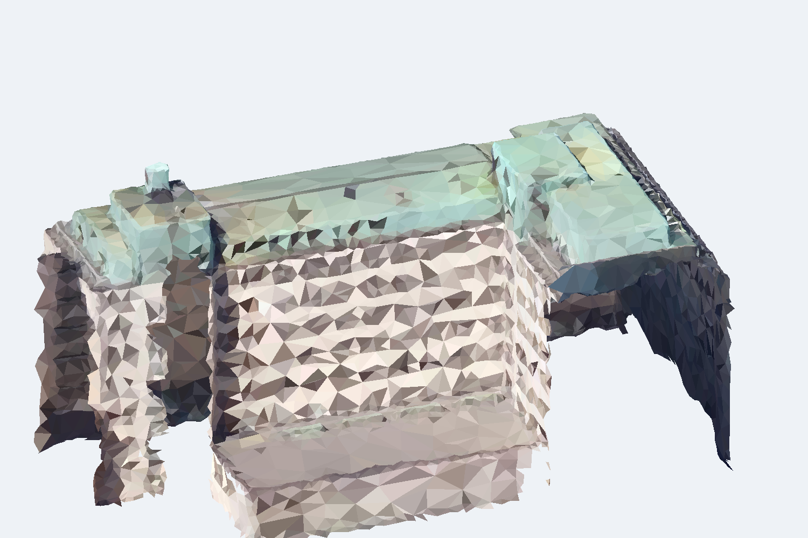

# Voimatalo：从 Helsinki 实景瓦片裁出的办公单体

本目录交付一个可直接复用的真实带贴图单体输入。目标是 Helsinki Kamppi 的 **Voimatalo**（Malminrinne 3 / Malminkatu 16），从既有 `Tile_+1984_+2690` 的**去标签 GLB**按公开建筑轮廓裁出。当前只完成输入准备，没有由开发助手手写内部房间，也没有运行体量到 BIM。



[完整 UV 贴图离线查看页](viewer.html) · [东南采色预览](view_southeast.png) · [近俯视采色预览](view_top.png) · [公开轮廓叠图](view_footprint_overlay.png) · [可供三维工具读取的单体 GLB](input.glb) · [机器检查](inspection.json) · [边界与来源](selection.json)

页面中的静态 PNG 都是按每个三角面的 UV 中心取一个颜色的**选材/范围概览**，足以检查裁剪轮廓和主体方向，不是完整纹理渲染，不能用来精读窗、门或立面文字。`viewer.html` 沿用上一轮离线查看页方式，把每个顶点 UV 和目标面实际引用的贴图像素载入 Three.js；当前 worktree 没有浏览器，其运行状态仍待独立浏览器检查。

## 为什么选它

- [Helsinki 市博物馆公开条目](https://www.finna.fi/Record/hkm.223B0A4A-8232-4304-BA56-752B1E559A7C?lng=fi)明确把它记作现用办公楼：地上八层，其中六个相近的办公标准层，顶层和沿街首层退入，首层含商业空间。用途不靠外形猜测。
- [OpenStreetMap way 15242619](https://www.openstreetmap.org/way/15242619) 提供名称、地址及单体轮廓。OSM 记 `building:levels=7`、`roof:levels=1`，与市博物馆的八层口径可解释为主体层加屋面层；生成时仍需把层数来源和可见证据写清楚。
- 公开轮廓完整落在已下载瓦片内，距瓦片边界足够远。建筑是办公为主、沿街商业的常见单体，属于当前办公/住宿/商业研究范围；它不是仅凭“看起来像办公楼”入选。

它同时是受保护的 1950 年代历史建筑，外壳和屋顶细节不代表随机抽取的新建办公楼。首例选择优先解决“有公开身份和完整边界的真实输入”，不能据此声称已覆盖普通办公建筑的广泛形态；后续仍需另一栋更普通的跨样例验证。

## 范围、尺度与变换

City of Helsinki 说明其实景网格可在 ETRS-GK25/N2000 中量测，顶点相对真实位置约 20 cm；公开 `hki-3d-blender` 技术模板说明 2017 网格以米为单位、城市模型局部原点为 EPSG:3879 的 `(25490000, 6668000)`，东为 +X、北为 +Y。SUM 瓦片的 250 m 边界与这套局部网格数值吻合。把 OSM 轮廓投影到 EPSG:3879 后减去该原点，轮廓与瓦片中目标外墙对齐；这一步是跨来源配准推论，`selection.json` 保存坐标与依据，不冒充 GLB 内嵌元数据。

公开轮廓面积约 **1,541.90 m²**，轴向范围约 **46.80 × 61.27 m**。裁后实景表面包围盒约 **48.46 × 62.65 × 34.27 m**；平面多出的约 1–2 m 来自三角面跨界和 0.35 m 配准容差，34.27 m 是扫描表面从最低保留点到最高屋面点的高差，不是实测檐高。输出以轮廓中心为平面原点，以保留网格最低点为 `y=0`，GLB 保持米制和 Y 轴朝上。

裁剪按三角面中心是否落在“公开轮廓 + 0.35 m 缓冲”内决定。这个缓冲用于吸收公开轮廓与摄影测量网格间的分米级登记差，代价是楼脚可能保留一条很窄的地面/邻接表面。输入不是封闭实体，不能把 `watertight: false` 当成 BIM 已闭合，也不能把裁剪边缘当作真实外墙。

## 生产输入与评价资料隔离

脚本只读取先前从标签白名单重建的 `derived/Tile_+1984_+2690/input.glb`，不打开带 SUM 评测标签的原始 PLY。输出 GLB 只有 `POSITION` 和 `TEXCOORD_0`，无 mesh/primitive extras；重新加载后仍有纹理映射。为避免把目标外的环境图片藏在材质图集中，脚本把没有被选中三角面引用的图集像素改成中性灰，仅保留目标面和边缘 2 px 采样余量；随后有损重编码为 JPEG quality 95。UV 对应关系保留，但不声称像素相同或无损纹理往返。输出没有标签、分段 ID、置信度、房间、周边可读贴图或历史答案。

未来生成 Agent 可得到 `input.glb`、完整 UV 查看页、三张面中心采色的范围概览、经公开来源核实的办公/沿街商业用途和八层信息。静态概览不足以精读开口，模型需要查看完整 UV 页面或由三维观察工具生成局部视图。当前内部隔墙、房间数、内部门、连通、标准层今天是否仍完全一致均未知，必须作为推断/假设。市博物馆页面可用于核实类型，但其历史平面图不进入第一份生产输入；生成结果不能声称恢复了真实内部。

## 复现与已验证范围

本地原瓦片大资产仍保留在主工作树的忽略目录，没有改写或提交。复现命令显式传入该去标签 GLB：

```bash
python case_tests/textured_mass/prepare_single_building.py \
  --selection case_tests/textured_mass/single_buildings/voimatalo/selection.json \
  --tile-glb /workspaces/EnergyPlus-Agent-dev/case_tests/textured_mass/derived/Tile_+1984_+2690/input.glb \
  --out case_tests/textured_mass/single_buildings/voimatalo
```

实际检查为：源 SHA-256 命中；从 385,685 面中选出 12,520 面、8,242 顶点；输出重新加载仍保留 12,520 面和纹理映射；GLB 属性/metadata 白名单通过；三张面中心采色概览和一张公开轮廓叠图已实际打开检查。完整 UV 的 `viewer.html` 已生成并做脚本语法检查，但当前环境未发现 Chromium/Chrome/Firefox，故没有声称浏览器交互查看已验证。GLB 不是闭合体，尚未运行 BIM 生成。
