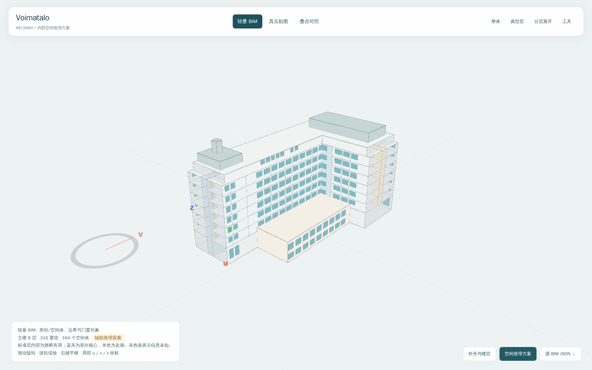

# Voimatalo：真实贴图单体到轻量 BIM

[打开交互展示](index.html) · [外壳与楼层](envelope.html) · [原始贴图](input_viewer.html) · [下载 GLB](input.glb)

主助手按用户要求直接判读真实网格和完整 UV 贴图，再用项目已有几何工具构建模型。目标是较细的可查看轻量 BIM；这是开发助手辅助探索，不是生产 Agent 的独立冷启动成绩，也未量化证明达到“相对高精度”。

## 输入与产物

输入为 Helsinki 城市摄影测量数据裁出的 Voimatalo 单体，属于 Google Earth 类实景体量，素材并非来自 Google Earth。`input.glb` 是 **glTF 2.0 二进制文件（GLB），969,568 字节，约 0.92 MiB**，包含 12,520 个三角面、8,242 个顶点和内嵌 JPEG 贴图，没有房间、楼层、门窗等 BIM 语义。来源、裁剪和授权信息沿用[原输入说明](../../../../case_tests/textured_mass/single_buildings/voimatalo/README.md)与 `input_selection.json`。

| 版本 | 模型范围 | 空间体 | 窗组 | 门 |
|---|---|---:|---:|---:|
| 外壳与楼层 | 主楼八层、附属体、屋顶体量；内部合并 | 12 | 316 | 2 |
| 空间推理方案 | 六个办公标准层加入办公室、走廊、服务空间和两处连续竖向核心 | 164 | 316 | 165 |

“窗组”可能包含多片玻璃，不能等同于逐扇窗真值；164 是推理方案的空间体数量，不能表述为还原了 164 个实际房间。两版输出均包含独立空间、边界、开口、宿主关系和来源说明，保存于 `exterior/`、`inferred/` 的 `source_model.json`；没有生成 IFC 或仿真结果。

## 怎么演示

页面顶部切换“轻量 BIM / 真实贴图 / 叠合对照”，三个模式共用固定坐标。可旋转、缩放、平移；“典型层”查看内部假设，“分层展开”查看楼层关系，“工具”开启过滤、透明度、剖切和量测。底部可换版本和下载源 BIM JSON。主 HTML 的脚本、纹理、几何均内嵌，可直接离线打开，也可用 iframe 嵌入后续 slides。



## 哪些仍是估计

- L 形轮廓、楼层高度、退台及窗口依据网格和贴图量测后规整，未做逐点贴合；重复标准层窗组按可见排布建模。
- 内部隔墙、门及竖向核心位置是明确的办公布局假设。核心中没有逐层封堵的假楼板，未建楼梯踏步和电梯。附属体内部楼板未知，保持合并空间。
- 两个端部的原始网格几乎缺失，以灰色未知边界保留，不凭空补上规则窗排；首层两处入口位置和门槛仍为估计。
- 屋顶曲面简化为水平顶面和组合体块；地面坡度、遮挡面和细窗框尚未精细恢复。采用墙的代表面，未建材料分层或完整实体墙。
- 查看坐标为局部 u / v / z，v 箭头不是正北。源 JSON 记录从原 GLB 米制坐标到当前坐标的变换。

## 验证与复现

源几何、接触关系和开口宿主检查无严重问题，最终状态为 **warning**，原因是明确保留的未知围护；不等于实际建筑保真通过。七个高度切片与本次采用的主楼轮廓覆盖一致，此检查证明方案内部自洽，不能证明符合真实内部。离线浏览器实际检查模式切换、纹理加载、旋转、典型层及分层展开，详见[实验与 QA](../../../../AI_agent/logs/experiments/2026-09-10_showcase_textured_mass/README.md)。

在仓库根使用项目 Python 环境复现到新目录，不覆盖现有资产：

```bash
python AI_agent/logs/experiments/2026-09-10_showcase_textured_mass/refine_asset.py --out /tmp/voimatalo-exterior-new
python AI_agent/logs/experiments/2026-09-10_showcase_textured_mass/refine_asset.py --interiors --out /tmp/voimatalo-inferred-new
```

脚本显式构造带逐层轮廓的 v2 类型对象并调用既有几何内核；`proposal.json` 是记录，不应直接当作通用 CLI 已支持的新输入接口。主展示页由同目录的 `package_viewers.py` 包装，本轮未修改产品几何、管线、GT 或历史成果。
